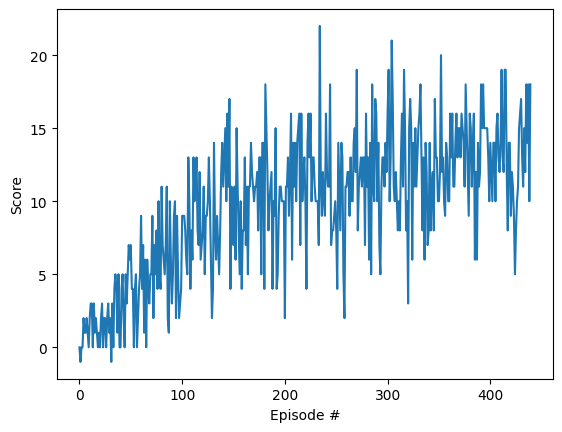
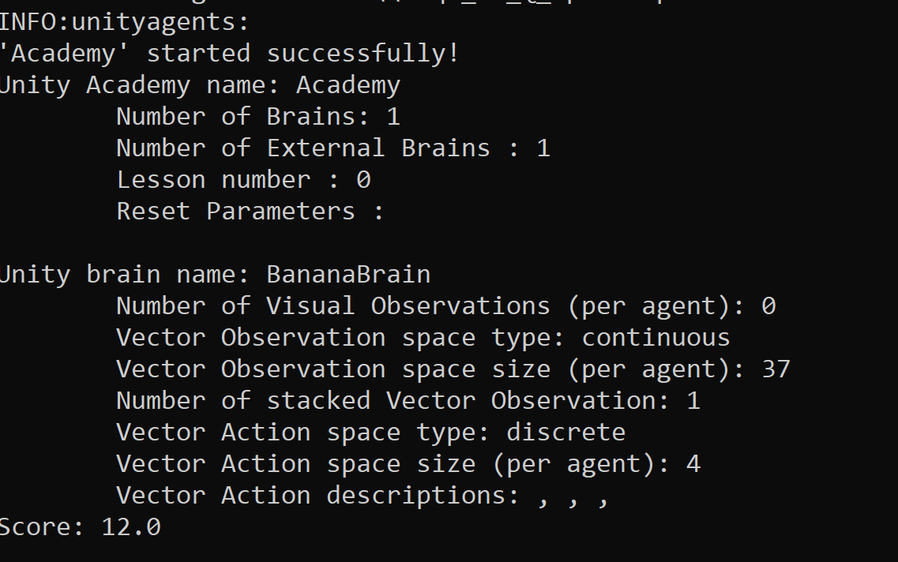
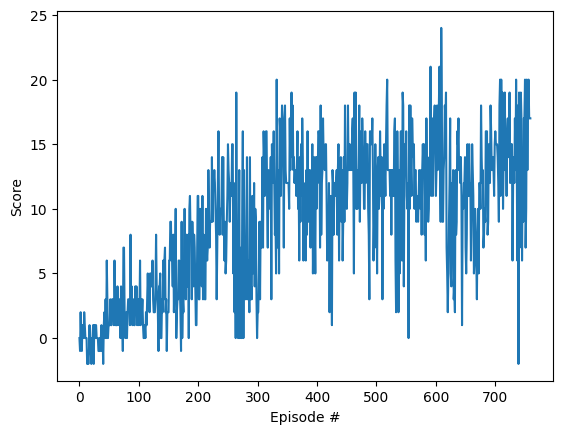
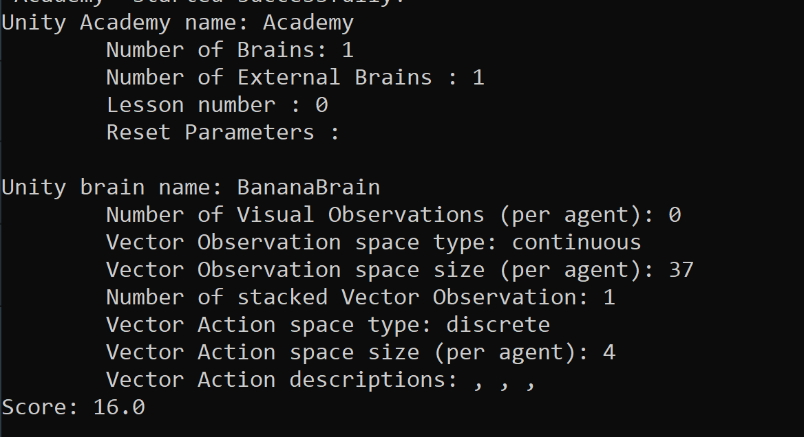
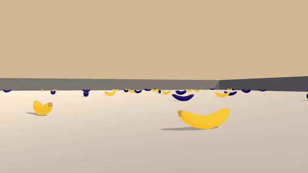

[//]: # (Image References)

[image1]: https://user-images.githubusercontent.com/10624937/42135619-d90f2f28-7d12-11e8-8823-82b970a54d7e.gif "Trained Agent"

# Project 1: Navigation

### Introduction

For this project, you will train an agent to navigate (and collect bananas!) in a large, square world.  

![Trained Agent][image1]

A reward of +1 is provided for collecting a yellow banana, and a reward of -1 is provided for collecting a blue banana.  Thus, the goal of your agent is to collect as many yellow bananas as possible while avoiding blue bananas.  

The state space has 37 dimensions and contains the agent's velocity, along with ray-based perception of objects around agent's forward direction.  Given this information, the agent has to learn how to best select actions.  Four discrete actions are available, corresponding to:
- **`0`** - move forward.
- **`1`** - move backward.
- **`2`** - turn left.
- **`3`** - turn right.

The task is episodic, and in order to solve the environment, your agent must get an average score of +13 over 100 consecutive episodes.

### Getting Started

1. Download the environment from one of the links below.  You need only select the environment that matches your operating system:
    - Linux: [click here](https://s3-us-west-1.amazonaws.com/udacity-drlnd/P1/Banana/Banana_Linux.zip)
    - Mac OSX: [click here](https://s3-us-west-1.amazonaws.com/udacity-drlnd/P1/Banana/Banana.app.zip)
    - Windows (32-bit): [click here](https://s3-us-west-1.amazonaws.com/udacity-drlnd/P1/Banana/Banana_Windows_x86.zip)
    - Windows (64-bit): [click here](https://s3-us-west-1.amazonaws.com/udacity-drlnd/P1/Banana/Banana_Windows_x86_64.zip)
    
    (_For Windows users_) Check out [this link](https://support.microsoft.com/en-us/help/827218/how-to-determine-whether-a-computer-is-running-a-32-bit-version-or-64) if you need help with determining if your computer is running a 32-bit version or 64-bit version of the Windows operating system.

    (_For AWS_) If you'd like to train the agent on AWS (and have not [enabled a virtual screen](https://github.com/Unity-Technologies/ml-agents/blob/master/docs/Training-on-Amazon-Web-Service.md)), then please use [this link](https://s3-us-west-1.amazonaws.com/udacity-drlnd/P1/Banana/Banana_Linux_NoVis.zip) to obtain the environment.

2. Place the file in the DRLND GitHub repository, in the `p1_navigation/` folder, and unzip (or decompress) the file. 

### Results

The final structure for this project was a **Double Learning Dueling Network with Prioritzed Experience Learning**. The reason for the selection are as follows:
    - To reduce the chance of overestimating the q_values we used the [double learning scheme](https://arxiv.org/pdf/1509.06461.pdf).
    - [Dueling network](https://arxiv.org/pdf/1511.06581.pdf) was chosen as it can help the agent compare similarly valued actions more accurately and faster.
    - Using [prioritized replay](https://arxiv.org/pdf/1511.05952.pdf) lets the agent use past experiences to train quicker.

Other tweaks included:
    - Activating the logits before calculating the advantage which seemed to speed up the learning. 
    - Learning over multiple replay steps in one run. Optimal step count was 4.

#### 32_32 Network
The network uses a network with two 32 hidden dimension layers before the value and advantage layers are calculated.
The distribution of the average score per episode is shown below:

When evaluated, the we were able to achieve a score of 12

#### 128_128 Network
The network uses a network with two 128 hidden dimension layers before the value and advantage layers are calculated.
With the steps taken the agent was able to learn in 1320 steps. The distribution of the average score per episode is shown below

When evaluated, the we were able to achieve a score of 16

Sample run with the 32x32 model

