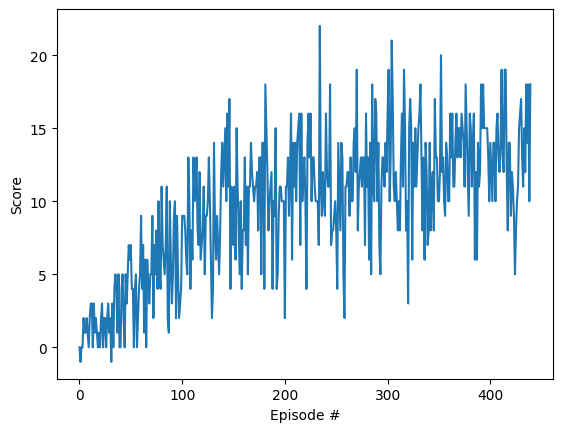
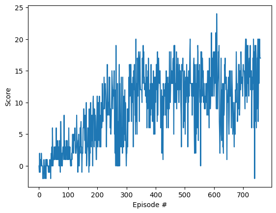

### Report
The project goal is to train an agent to navigate (and collect bananas!) in a large, square world. The agent must get an average score of +13 over 100 consecutive episodes. A reward of +1 is provided for collecting a yellow banana, and a reward of -1 is provided for collecting a blue banana.  Thus, the goal of your agent is to collect as many yellow bananas as possible while avoiding blue bananas.  

The state space has 37 dimensions and contains the agent's velocity, along with ray-based perception of objects around agent's forward direction.  Given this information, the agent has to learn how to best select actions.  Four discrete actions are available, corresponding to:
- **`0`** - move forward.
- **`1`** - move backward.
- **`2`** - turn left.
- **`3`** - turn right.

### Agent Design
The final structure for this project was a **Double Learning Dueling Network with Prioritzed Experience Learning**.
   1) To reduce the chance of overestimating the q_values we used the [double learning scheme](https://arxiv.org/pdf/1509.06461.pdf). 
   2) [Dueling network](https://arxiv.org/pdf/1511.06581.pdf) was chosen as it can help the agent compare similarly valued actions more accurately and faster. 
   3) Using [prioritized replay](https://arxiv.org/pdf/1511.05952.pdf) lets the agent use past experiences to train quicker.

Other tweaks included: 
   1) Activating the logits before calculating the advantage which seemed to speed up the learning
   2) Learning over multiple replay steps in one run. Optimal step count was 4.

### Parameters

All networks were trained with adam optimizers using the same learning rate of 5e-4 and a batch size of 1024. The parameters used are described below. 

```
    # Agent parameters
    agent_parameters = {
        'network_config': {
            'state_size': state_size,
            'array_fc_units': [32, 32],
            'action_size': action_size
        },
        'optimizer_config': {'learning_rate': 0.0005},
        'replay_buffer_size': 100000,
        'batch_size': 64,
        'num_replay_updates_per_step': 8,
        'gamma': 0.9,
        'greedy':{'explore_start':1.0,
                  'explore_stop':0.01,
                  'decay_rate':0.00005},
        'softmax_tau': 0.001,
        "seed": 0
```

### Results
#### 32_32 Network
The network uses a network with two 32 hidden dimension layers before the value and advantage layers are calculated.
The distribution of the average score per episode is shown below. The environment was solved in **340 episodes**:
<p align="center">

</p>

When evaluated, the we were able to achieve a score of 12
<p align="center">

</p>

#### 128_128 Network
The network uses a network with two 128 hidden dimension layers before the value and advantage layers are calculated.
With the steps taken the environment was solved **1320 steps**. The distribution of the average score per episode is shown below
<p align="center">

</p>

When evaluated with a fully trained agent, we were able to achieve a score of 16
<p align="center">

</p>

The saved weights can be found in the results checkpoint directory.

### Future Improvements
1) Fine tune network parameters. Smaller layer units can lead to faster convergence.
2) Explore other value based options. TD3 seems like an upgraded version of DDQN so try that.
3) Explore ways to boost learning without iteratinf multiple samples per optimization step.
4) Seeing that one-step TD learning has high bias. One can look into n-step bootstrap methods. 

